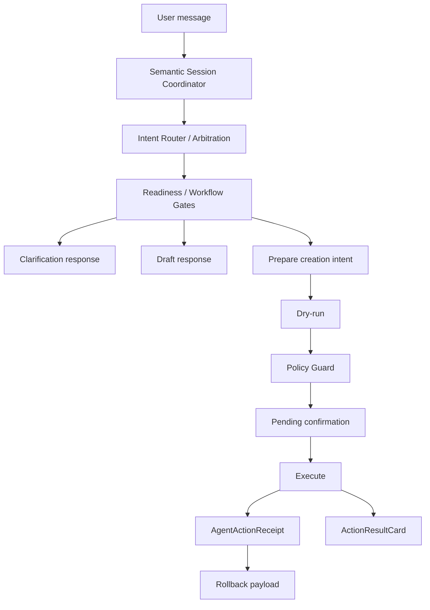
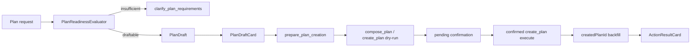
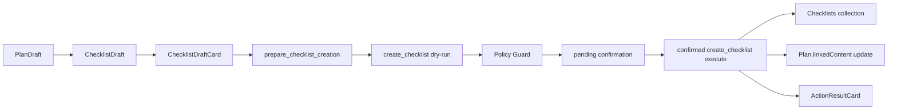
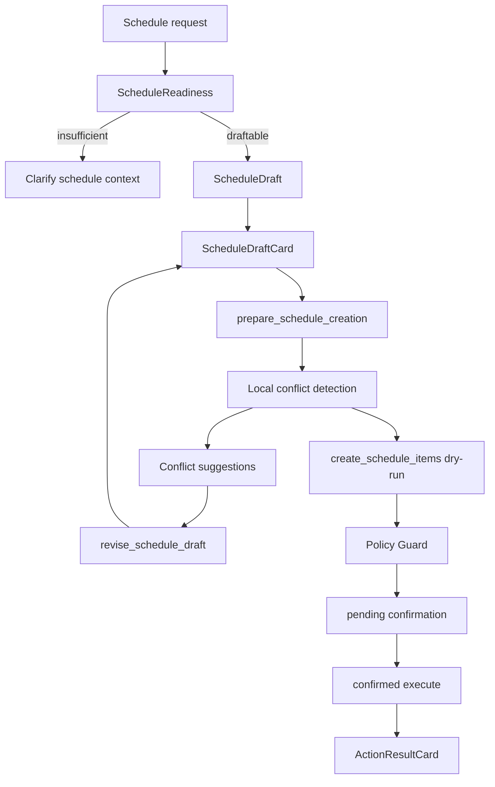

# SunnyPanel Agent Workflow v1

Status: frozen for Agent Workflow v1 closure.

This document records the current Agent workflow contract after the Planning, Checklist, Schedule, Timeline, Progress, Safety, Dashboard, Ops, and public-site closure phases. It is an architecture reference for future workflow changes. It does not introduce new behavior.

## 1. Overview

SunnyPanel Agent Workflow v1 turns natural-language goals into structured workspace artifacts: plans, checklists, schedules, timeline events, public writing context, and auditable execution results.

The v1 design is intentionally staged. The Agent can understand, clarify, draft, prepare, and propose before any write. Database writes happen only after the safety chain accepts the operation and the user confirms it.



## 2. Core Principles

- Understanding intent is not execution.
- A draft is not a database write.
- User approval of a draft is not final execution.
- Medium and high risk writes must pass dry-run, Policy Guard, pending confirmation, execute, receipt, and rollback boundaries.
- Execution must be traceable through AgentRun, AgentThreadEvent, and AgentActionReceipt records.
- Supported writes must have an explicit rollback payload or clearly report that rollback is unavailable.
- Large or under-specified workflows should clarify or draft before creating a write proposal.

These principles are product rules, not just implementation details. New workflows should preserve the same user mental model: draft first, confirm later, execute last.

## 3. Planning Workflow

Planning handles long-running goals such as product launches, study plans, projects, and multi-stage work.



### Readiness

`PlanReadinessEvaluator` is a rule-first pure function. It does not call an LLM, read the database, or depend on current time unless time is passed in.

Plan slots include:

- `goal`
- `deadline`
- `scope`
- `currentProgress`
- `availableTime`
- `successCriteria`
- `priority`
- `deliverables`
- `constraints`

A large plan with only `goal + deadline` is insufficient. It should ask follow-up questions instead of inventing scope and moving directly into confirmation.

### PlanDraft

`draftable` readiness creates a PlanDraft. The draft can include stages, tasks, assumptions, risks, and success criteria, but it is still only an assistant artifact. It must not write to Plans.

`PlanDraftCard` shows the draft state and provides actions to continue editing or prepare creation. It must not show execution or result wording.

### prepare_plan_creation / create_plan

`prepare_plan_creation` converts a valid PlanDraft into the existing plan creation intent and args. It does not execute. The existing dry-run and Policy Guard path creates the pending confirmation.

Only after confirmation can `create_plan` execute and return created plan ids. The created plan id is backfilled into planning session state so downstream checklist creation can link to the real Plan record.

## 4. Checklist Workflow

Checklist workflow turns a PlanDraft into concrete grouped tasks.



Key rules:

- ChecklistDraft is draft-only and never writes.
- Checklist creation executes only after pending confirmation.
- `sourcePlanId` is carried from the executed Plan lifecycle. It is never guessed from a title.
- When `sourcePlanId` exists, successful checklist creation appends a checklist relation into `Plan.linkedContent`.
- If Plan linkage fails after checklist creation, the created checklist is cleaned up as compensation.
- Duplicate confirmation is protected by AgentActionReceipt replay.

## 5. Schedule Workflow

Schedule workflow turns tasks into concrete local schedule items. v1 does not support recurrence, external calendars, or automatic rescheduling.



Schedule readiness considers source tasks, available time, deadline, preferred time, conflict policy, and whether an existing draft is being confirmed.

ScheduleDraft remains non-persistent. It can show assumptions, conflicts, and local suggestions. Selecting a suggestion only updates the draft through `revise_schedule_draft`.

Conflict detection is local to SunnyPanel schedule-items. Suggestions can propose moving to a local free slot, allowing overlap, removing an item, or manual adjustment. They do not claim that external calendars were checked.

`create_schedule_items` writes schedule-items only after confirmation. Execution returns created ids, count, date range, rollback payload, and a result card.

## 6. Timeline / Progress

Timeline and progress semantics are deliberately narrow.

Checklist completion:

- Completing a checklist item creates or updates one checklist-sourced Timeline event.
- `relatedChecklist` points to the checklist.
- `relatedTaskKey` uses the checklist item id.
- Completion notes update Timeline description without duplicate events.
- Creating a checklist does not create Timeline events.
- Appending checklist items does not create Timeline events.

Plan progress:

- Plan progress is computed from linked checklists.
- v1 does not write `Plan.progress`.
- Rollback restores checklist state or linkedContent; computed progress follows from restored data.

This keeps progress derivable and avoids a second mutable truth source.

## 7. Safety Workflow

All write workflows use the same safety chain:

```text
intent
-> readiness or workflow gate
-> draft or dry-run
-> Policy Guard
-> pending confirmation
-> execute
-> AgentActionReceipt
-> rollback payload
```

Non-negotiable rules:

- No direct writes from draft cards.
- No medium or high risk write before pending confirmation is confirmed.
- Executors must not bypass Policy Guard.
- Raw LLM output is not treated as trusted final data.
- Repeated confirmations must replay receipts instead of writing again.
- Rollback must target only documents affected by the recorded action.

## 8. Session State

AgentSessionState stores workflow context without adding database columns.

Planning state can hold:

- current planning workflow stage
- plan slots
- PlanDraft
- ChecklistDraft
- `sourcePlanId` lifecycle metadata

Scheduling state can hold:

- current scheduling workflow stage
- schedule slots
- ScheduleDraft
- conflict policy
- local conflict notes
- local free slot suggestions

`pendingAction` remains the confirmation boundary. When present, confirmation UI has priority over draft projection.

Compatibility rules:

- Old threads must normalize safely.
- Invalid draft fields are filtered.
- Session state can guide routing and UI projection, but it must not force writes.

## 9. UI Cards

Workflow UI is state-separated.

Draft cards:

- `PlanDraftCard`
- `ChecklistDraftCard`
- `ScheduleDraftCard`

Draft cards must say the work is not written yet and must not show confirmation or result language.

Confirmation cards:

- `PlanConfirmationCard`
- `AgentApprovalCard` variants for checklist and schedule creation

Confirmation cards must say confirmation is required before writing.

Result cards:

- `ActionResultCard`

Result cards show completed writes, created ids, counts, linked sources, rollback availability, and user-facing summaries.

`MessageCard` remains a dispatcher. It should not accumulate workflow-specific card body JSX.

## 10. Observability

Agent Ops Center provides a read-only operational view:

- recent AgentRun records
- recent AgentActionReceipt records
- pending confirmations
- recent failures or indeterminate actions
- token, latency, model, actionId, threadId, and operation summaries

Ops UI is diagnostic. It does not execute pending actions, trigger rollback, or mutate Agent state.

## 11. Rollback / Receipt

AgentActionReceipts protect execute and rollback operations.

Write execution should:

- claim or replay a receipt by stable action id
- write exactly once for repeated confirmations
- store created ids and rollback payloads
- return prior terminal results when replayed

Rollback should:

- use server-stored payloads, not arbitrary client input
- target only documents created or changed by the action
- be idempotent where practical
- avoid affecting unrelated Timeline, Checklist, Plan, or Schedule records
- report indeterminate state when compensation cannot be completed

## 12. Test Baseline

Current v1 baseline:

- `npm run test:content`
- `npm run test:agent`
- `npm run test:agent:planning`
- `npm run test:agent:schedule`
- `npm run typecheck`
- `npm run lint`
- `git diff --check`

Public browser smoke exists separately as `npm run test:e2e:public` and requires a non-production Postgres database. See `docs/public-site-e2e.md`.

## 13. Known Boundaries

Agent Workflow v1 intentionally does not include:

- ChecklistDraft revise workflow.
- Schedule recurrence.
- External Calendar integration.
- Automatic conflict rescheduling.
- Multi-user planning permissions beyond existing access boundaries.
- New Payload schema or migrations for workflow state.
- Direct Plan progress writes.
- Full natural-language editing of every created draft field.
- High-risk external system writes.

## 14. Backlog

Recommended post-v1 backlog:

- ChecklistDraft revise flow.
- More precise natural-language draft editing.
- Optional Plan to Schedule sequencing controls.
- External Calendar read-only conflict awareness.
- Recurrence design with explicit confirmation and rollback semantics.
- Better rollback result UI for partially compensated actions.
- More E2E coverage for full browser interaction flows.
