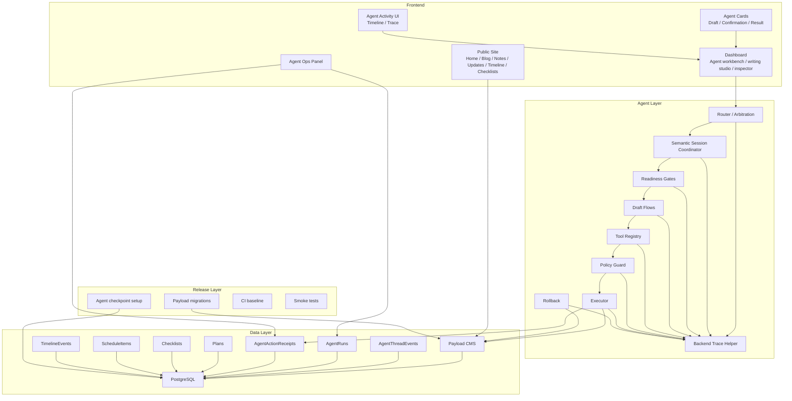

# SunnyPanel System Architecture

SunnyPanel is an AI-native personal long-term workbench built on Next.js, Payload CMS, PostgreSQL, and a staged Agent workflow.

This document summarizes the major system layers and responsibilities. It avoids secrets and deployment-specific values.

## 1. System Map



## 2. Frontend Layer

### Public Site

The public site presents the long-term workspace externally:

- Home positions SunnyPanel as an AI-native personal long-term workbench.
- Blog is for long-form writing.
- Notes are shorter thoughts.
- Updates are a time-aware activity feed.
- Timeline creates long-term narrative structure.
- Checklists show public progress instead of backend task tables.
- Static pages such as About, Now, and Projects use the same public shell.

Public content uses the shared `sunny-prose` rendering layer.

### Dashboard

Dashboard is the private workspace. It contains:

- Agent conversation
- draft cards
- approval cards
- result cards
- writing workspace
- right inspector
- Agent Ops view

The Dashboard should make workflow state visible: draft, confirmation, execution result, rollback, and trace.

### Agent Cards

Cards separate user mental states:

- Draft cards show "not written yet".
- Confirmation cards show "will write after confirmation".
- Result cards show "already written".

`MessageCard` dispatches to the right card but does not own every workflow-specific card body.

### Agent Activity / Trace UI

Agent Activity is a structured status layer shown below Agent messages and in the right inspector. It maps existing response state, drafts, pending confirmations, execution results, rollback results, and legacy trace summaries into typed activity steps.

The main conversation shows only user-visible activity such as "已识别为日程查询", "草案尚未写入数据库", or "等待你确认". The right Trace tab can show developer-visible metadata and sanitized details.

Activity UI is not Chain-of-Thought and must not expose raw prompts, raw LLM responses, Authorization headers, cookies, tokens, or large unredacted payloads.

Backend trace instrumentation emits sanitized `backendTraceEvents` from the Agent pipeline, LangGraph adapter, dry-run step, execute step, and rollback API. These events are attached to the terminal `AgentChatResponse`, persisted through existing `AgentThreadEvents`, and converted into developer-visible `AgentActivityStep` records for the Inspector. Trace write failures are non-blocking and must not alter Agent behavior.

### Agent Ops Panel

Ops is read-only. It summarizes recent AgentRun, AgentActionReceipt, pending confirmations, failures, tokens, model, latency, action id, and thread id.

It does not execute, confirm, or rollback actions.

## 3. Agent Layer

### Router / Arbitration

Router identifies the likely intent and target domain. Arbitration resolves ambiguity and prevents ordinary questions from being promoted into writes.

### Semantic Session Coordinator

Session coordination tracks workflow context across turns. It keeps planning and scheduling slots, drafts, stage, pending action context, and follow-up information.

### Readiness Gates

Readiness gates decide whether a workflow is ready to clarify, draft, or prepare creation.

Examples:

- PlanReadiness prevents a large plan with only goal and deadline from becoming a write proposal.
- ScheduleReadiness prevents schedule creation when available time or concrete task timing is missing.

### Draft Flow

Draft flow creates structured artifacts that are useful but not persisted as business records:

- PlanDraft
- ChecklistDraft
- ScheduleDraft

Draft flow exists to separate helpful generation from database writes.

### Tool Registry

Tool registry maps supported capabilities to dry-run and execute behavior. It is the boundary between resolved intent and concrete operations.

### Policy Guard

Policy Guard checks allowed capabilities, target resolution, and risk level before pending confirmation.

### Executor

Executor performs confirmed writes. It should receive structured args, validate required fields, write through Payload, create audit records, and return rollback metadata.

### Rollback

Rollback applies server-recorded compensation payloads. It should not trust arbitrary client-provided mutation payloads.

Rollback route instrumentation records sanitized rollback start/success/failure trace events in the API response. The rollback executor and receipt semantics remain unchanged.

## 4. Data Layer

### Payload CMS

Payload owns collections and access-controlled local API writes.

### PostgreSQL

PostgreSQL stores Payload records, Agent event data, action receipts, and checkpoint-related state.

### AgentThreadEvents

Append-only event stream for Agent turns, terminal responses, pending projections, and reconstruction.

### AgentRuns

Audit records for Agent execution. They help inspect what happened, when it happened, and which rollback payload is available.

### AgentActionReceipts

Idempotency records for execute and rollback. They prevent duplicate writes and support replaying terminal results.

### Business Collections

Core business collections include:

- Plans
- Checklists
- ScheduleItems
- TimelineEvents
- PlanReviews
- Posts
- Notes
- Updates
- Pages

Agent workflow should write these only through confirmed executor paths.

## 5. Release Layer

Release uses explicit operational steps:

- `PAYLOAD_DB_PUSH=false`
- `npm run migrate`
- `npm run agent:checkpoint:setup`
- `npm run build`
- Agent smoke test after deployment

CI baseline runs typecheck, lint, Agent tests, planning tests, schedule tests, migrations against a CI database, and build where configured.

Public browser E2E is separated because it needs a real Next server and a non-production Postgres-backed Payload app.

## 6. Architecture Rule of Thumb

When adding a new workflow, follow the v1 pattern:

```text
readiness
-> draft
-> prepare
-> dry-run
-> Policy Guard
-> pending confirmation
-> execute
-> receipt
-> rollback
-> result card
```

Skipping one of these stages should be a deliberate design decision, not an implementation shortcut.
